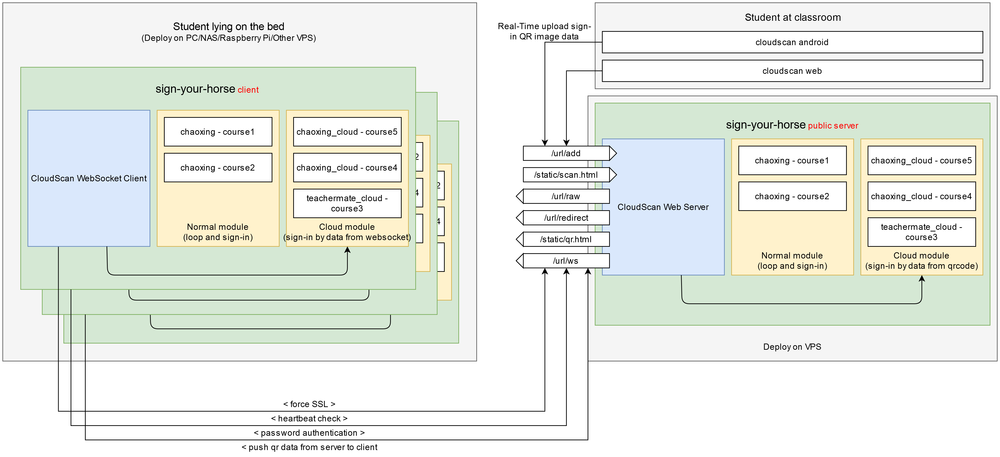

# Sign your horse 签个马

```
┌─┐┬┌─┐┌┐┌  ┬ ┬┌─┐┬ ┬┬─┐  ┬ ┬┌─┐┬─┐┌─┐┌─┐
└─┐││ ┬│││  └┬┘│ ││ │├┬┘  ├─┤│ │├┬┘└─┐├┤
└─┘┴└─┘┘└┘   ┴ └─┘└─┘┴└─  ┴ ┴└─┘┴└─└─┘└─┘
```

> 一站式签到解决方案
> All-in-One sign-in solution



## 1. 使用方法

```
$ ./sign-your-horse -h
Usage of sign-your-horse.exe:
  -config string
        specify config file (default "config.json")
```

直接运行，会在目录下创建config.json，包含默认配置

```
{
	"cloudscan": {
		"server_enable": true,
		"server": "0.0.0.0:3000",
		"usehttps": true,
		"srvcert": "cert.pem",
		"srvkey": "key.pem",
		"ws_api_enable": true,
		"ws_api_password": "1145141919810"
	},
	"cloudscan_client": {
		"client_enable": false,
		"server": "wss://www.pornhub.com/url/ws",
		"ws_api_password": "1145141919810",
		"verbose": true,
		"heartbeat_interval": 10
	},
	"provider": [
		{
			"name": "chaoxing_cloud_default",
			"module": "chaoxing_cloud",
			"config": {
				"cookie": "",
				"useragent": "",
				"uid": "",
				"courseid": "",
				"classid": ""
			}
		},
		{
			"name": "teachermate_cloud_default",
			"module": "teachermate_cloud",
			"config": {}
		},
		{
			"name": "chaoxing_default",
			"module": "chaoxing",
			"config": {
				"cookie": "",
				"useragent": "",
				"uid": "",
				"courseid": "",
				"classid": "",
				"interval": 5,
				"tasktime": [
					{
						"weekday": 1,
						"time": "07:50",
						"duration": 20
					},
					{
						"weekday": 4,
						"time": "13:50",
						"duration": 20
					}
				],
				"verbose": true
			}
		}
	],
	"reporter": [
		{
			"name": "console",
			"config": {}
		},
		{
			"name": "wechat",
			"config": {
				"corpID": "",
				"corpSecret": "",
				"toparty": 0,
				"agentid": 0
			}
		}
	]
}
```

配置文件存在后即可直接运行，或使用`-config`指定配置文件运行

## 2. 各模块说明

sign-your-horse主要由以下几个模块组成

* cloudscan server
* cloudscan client
* Provider (cloud module + normal module)
* Reporter

### 2.1 cloudscan server

cloudscan server用于接收来自客户端上传的二维码签到信息，并分发给cloudscan client和cloud module完成签到

#### 2.1.1 工作原理

[CloudScan APP](https://github.com/naivekun/cloudscan-android)/CloudScan Web -> Sign-your-horse Server -> QRCode/Redirect/Text

到教室的同学使用[CloudScan APP](https://github.com/naivekun/cloudscan-android)或CloudScan Web(自带)扫描二维码 发送到后端

后端可以直接处理二维码中包含的字符串信息，完成签到，对于依赖微信的微助教，其他同学使用微信扫描后端提供的二维码或在微信里点击重定向链接即可跳转到签到页面

CloudScan Web使用WebRTC调用摄像头，使用此功能必须开启HTTPS或者自己把HTTP前面套一层HTTPS，你可以用以下命令生成一个自签名服务器证书

`openssl req -x509 -newkey rsa:4096 -keyout key.pem -out cert.pem -days 365 -nodes`

#### 2.1.2 HTTP接口说明

* `/static/qr.html` 3秒刷新一次验证码，可供直接使用手机扫描
* `/static/scan.html` CloudScan Web，到教室的同学使用，会使用浏览器调用摄像头，扫描二维码上传签到信息。(Thanks to @EarthC)
* `/url/add` 上传接口
* `/url/redirect` 重定向接口，点一下直接302跳到签到页面，适合微助教这种依赖微信登录的使用
* `/url/raw` 获取url明文
* `/url/ws`  用于cloudscan客户端连接服务端

### 2.2 cloudscan client

cloudscan client用于连接cloudscan server，从cloudscan server实时获取签到数据，并分发给自己的cloud module

### 2.3 Provider

Provider适配各个签到平台，提供Init/Run/Push方法和默认配置json。Run方法用于启动模块，常见于轮询签到的模块中。

Push方法在cloudscan收到消息后会被依次调用，模块会处理从cloudscan收到的实时二维码数据。约定以`_cloudscan`结尾的模块需要实现Push方法，处理来自cloudscan的消息

在配置文件中provider是一个列表，可指定某个平台的某个签到任务，如果有多节课需要签到可以配置多个provider即可。

#### 2.3.1 chaoxing

超星签到模块，各个参数说明如下

tasktime模块用于指定轮询签到时间，防止老师在非上课时间钓鱼执法

```
alias: "别名，用于推送消息时区分各个任务",
cookie: "超星登录cookie",
useragent: "User-Agent",
uid: "超星的uid，从cookie里面扣",
courseid: "课程ID",
classid: "班级ID",
interval: 轮询间隔,
tasktime: [ // 一个列表，成员如下
	{
		weekday: 4, //周四，周日是0
		time: "07:45", //任务开始时间，格式为HH:MM
		duration: 20 //签到活动持续时间，单位是分钟
	},
	{
		//支持多个时间段签到
	}
]
verbose: 是否显示详细信息
```

#### 2.3.2 chaoxing_cloud

超星云签到模块，各个参数说明如下

```
alias: "别名，用于推送消息时区分各个任务",
cookie: "超星登录cookie",
useragent: "User-Agent",
uid: "超星的uid，从cookie里面扣",
courseid: "课程ID",
classid: "班级ID",
```

#### 2.3.3 teachermate_cloud

微助教签到模块，目前仅实现了将收到的URL回传微信企业号


### 2.4 Reporter

Reporter用于接收Provider推送的数据，一般来说是签到成功/失败的通知。Provider的通知会依次调用所有Reporter推送信息

#### 2.4.1 wechat

用于向微信企业号推送消息

实时反馈签到状态，并配合微助教完成一键url跳转签到

#### 2.4.2 console

直接把消息print到console上

## 3. 开发

### 3.1 构建

由于使用了静态资源，你需要使用`packr`完成构建

```
$ packr build
```

### 3.2 provider

在provider目录增加模块，实现Init和Run方法，init函数中使用`provider.RegisterProvider`注册模块即可。

### 3.3 reporter

在reporter目录增加模块，实现Init和Report方法，init函数中使用`reporter.RegisterReporter`注册模块即可

自带的console模块会简单把结果打印到stdout，用它直接改是个不错的选择

## 4. License

MIT